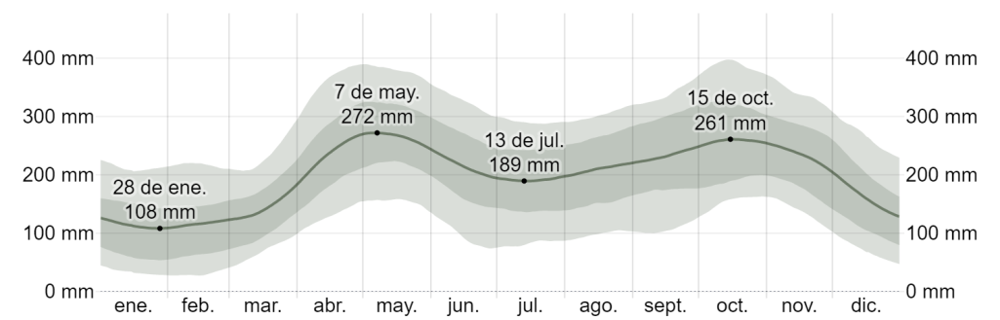

```{r setup, include=FALSE}
knitr::opts_chunk$set(echo = F, fig.align = "center")
library(knitr)
library(tidyverse)
library(magrittr)
library(lubridate)
library(forecast)
library(rjson)
library(plotly)
```

En el presente informe se cuenta como se realizó el proceso de depuración de
datos, creación de nuevas variables, manejo de fechas, obtención de los días
festivos, agrupamiento de datos entre otros. También se realiza análisis
descriptivo para obtener información que puede ser útil en el proceso de
modelación.

# Depuración de datos 

El proceso de depuración es probablemente uno de los pasos más importantes cuando
se quiere hacer análisis de datos pues un modelo es tan bueno como lo sea la 
calidad de información que se tenga.

### Falsos únicos

Para comenzar, se resalta que todas las variables son categóricas y la mayoría 
de tipo carácter, el problema radica en que una gran cantidad de observaciones 
eran falsos únicos, por ejemplo, para la variable clase de accidente se tienen 
7 posibles valores los cuales son: atropello, caida de ocupante, caída de 
ocupante, choque,  incendio, volcamiento y otro; note que el valor caida de 
ocupante y caída de ocupante realmente significan lo mismo, sin embargo si 
son observados como cadena de caracteres son diferentes, pues uno tiene tilde
y el otro no, lo cual implica que los lenguajes de programación los tomen como
dos cosas diferentes. La solución a este problema fue cambiar todas las cadenas
de caracteres "caída de ocupante" por "caida de ocupante" (se selecciona la 
cadena sin tilde para evitar posibles problemas con la codificación), esto
se traduce en que finalmente dicha variable tendrá posteriormente 6 valores
únicos como debería de ser. 

Este problema paso en varias variables de la base de datos y el proceso para 
solucionar dicho inconveniente fue análogo al hecho con la variable clase de 
accidente.

### Variable Location

Esta variable tuvo el problema de que las coordenadas de longitud y latitud 
estaban invertidas. La solución fue simplemente invertir las entradas.

### Datos faltantes en variables espaciales

Los datos faltantes es un problema típico en la mayoría de las bases de datos.
Para el caso particular de variables espaciales como barrio, comuna y número de
comuna se utilizó la variable Location después de ser arreglada tal como se
menciona en el párrafo anterior (pues esta no tuvo valores faltantes); con 
estas coordenadas se encontraron los datos faltantes.

### Ubicaciones fuera de Medellín

Las observaciones que estén ubicadas fuera de la ciudad son
eliminadas de la base de datos, teniendo en cuenta que el interés de estudio 
es en Medellín. Gracias a la variable Location se encontraron datos que no 
estaban ubicados en la ciudad; en total se eliminaron 19733 observaciones de
las cuales 19 estaban ubicadas en La estrella, 101 en Envigado y 19613 en
Heliconia.

### Variable CBML

Esta variable es el catastro y no fue tenida en cuenta pues se considera que 
no aporta información importante para el proceso de modelación o creación de 
nuevas variables.

# Construcción de la base de datos para modelación

Una vez limpiada la base de datos, se construye una nueva exclusivamente para 
el proceso de modelación. Para la construcción de esta base de datos se parte 
únicamente de la variable fecha de accidente y a partir de ella se van
construyendo las demás. A continuación se presenta la estructura de la base de 
datos resultante:

```{r}
basemodelo <- readRDS("basemodelo.Rds")
kable(head(basemodelo), 
             col.names = c("FECHA ACCIDENTE", "ACCIDENTES DIARIOS",
                           "DIA ACCIDENTE", "PRECIP MES", "FESTIVO",
                           "SEMANA", "QUINCENA"),
             align = "c")
```


### Fecha accidente y accidentes diarios

Las fechas de accidentes se obtienen al tomar los diez primeros caracteres de 
los datos contenidos en la variable FECHA_ACCIDENTE, por ejemplo considere la
cadena de caracteres 2014-08-05T12:15:00.000Z (la cual está en la base de datos
depurada), la subcadena con los primeros 10 caracteres es 2014-08-05. Para el
resto de observaciones se procedió de manera análoga. Posteriormente las
observaciones resultantes son convertidas en objetos de la clase Date y 
finalmente dichas fechas fueron contadas para obtener la frecuencia de 
accidentes diarios. Todo esto se hace gracias a las funciones `select()`,
`group_by()`, `mutate()`, `summarise()` y `n()` de la librería `dplyr` y la
función `as.Date()` que viene en los paquetes básicos de R.

### Día accidente

El día del accidente es obtenido gracias a la función `wday()` de la librería 
`lubridate` ingresándole un objeto de la clase Date, en este caso fecha de 
accidente (obtenida en el párrafo anterior).

### Precipitación del mes

<!-- [2]: https://es.weatherspark.com/y/22535/Clima-promedio-en-Medell%C3%ADn-Colombia-durante-todo-el-a%C3%B1o -->

Se consultó en [2] cuales son los meses que se pueden 
catalogar como lluviosos y secos en la ciudad de Medellín. Se encontró del 
gráfico que los meses marzo, abril, mayo, septiembre, octubre y noviembre se
pueden considerar 
como "lluviosos" y los demás como "secos", luego se usó la función `month()` 
de la librería `lubridate` y una instrucción condicional para determinar 
los meses que se pueden etiquetar como lluviosos o secos.



### Festivos y días especiales

<!-- [3]: https://github.com/nequibc/colombia-holidays -->

Se buscó la manera de llevar la información de días festivos a la base de datos.
Gracias a un repositorio de GitHub de Nequi [3] se encontró un modulo node.js el 
cual a través de JavaScript se pudo exportar a un objeto JSON, luego se usó la
función `fromJSON()` de la librería `rjson` para poder trabajar con JavaScript 
Objects Notation (JSON) en R y así extraer los datos de los días festivos en 
Colombia. 

### Semana y Quincena

La variable semana se obtuvo fácilmente gracias a la función `week()` de la 
librería `lubridate`. La variable Quincena se obtuvo mediante un proceso 
iterativo; los valores de esta variable cumplen las siguientes reglas:

* Si el día de quincena resulta ser un domingo el pago se realiza el día viernes
antes de la quincena
* Si el día de quincena resulta ser un día festivo, el pago se realiza un día 
antes siempre que este sea hábil de pago (por ejemplo si la quincena cae un 
lunes festivo, el retiro está habilitado el día sábado).

# Análisis descriptivo

En esta sección se buscan hallazgos que permitan encontrar relaciones que puedan
ser utiles en la construcción de modelos


## Distribución del número de accidentes diarios

```{r, fig.cap="Distribución del número de accidentes diarios por temporada climática"}
#Breaks con la regla de Sturges3
MySturges <- function(x){
  pretty(range(x),
       n = nclass.Sturges(x), 
       min.n = 1)
}
ggplot(basemodelo, aes(x = ACCIDENTES_DIARIOS)) +
  geom_histogram(breaks = MySturges(basemodelo$ACCIDENTES_DIARIOS),
                 col = "black", fill = "cyan") +
  facet_wrap(~PRECIP_MES) +
  labs(y = "Frecuencia",  x = "Accidentes diarios") +
  theme_bw() +
  theme(plot.title = element_text(hjust = 0.5))
```

Observe la gran similaridad entre la distribución del número de accidentes diarios en las temporadas secas y lluviosas lo cual sugiere que está variable no tiene efecto en el número de accidentes diarios.

```{r, fig.cap="Distribución de accidentes diarios por días de la semana"}
ggplot(basemodelo, aes(x = ACCIDENTES_DIARIOS)) +
  geom_histogram(breaks = MySturges(basemodelo$ACCIDENTES_DIARIOS),
                 col = "black", fill = "lightgreen") +
  facet_wrap(~DIA_ACCIDENTE) +
  labs(y = "Frecuencia",  x = "Accidentes diarios") +
  theme_bw() +
  theme(plot.title = element_text(hjust = 0.5))
```

Note que, en promedio, el número de accidentes diarios en los diferetes días de la semana es muy similar, sin embargo, existen ligeras diferencias en las distribuciones del número de accidentes.

```{r, fig.cap="Distribución de accidentes diarios los días festivos"}
ggplot(basemodelo, aes(x = ACCIDENTES_DIARIOS)) +
  geom_histogram(breaks = MySturges(basemodelo$ACCIDENTES_DIARIOS),
                 col = "black", fill = "blue", 
                 mapping = aes(y = ..density..)) +
  facet_wrap(~FESTIVO) +
  labs(y = "Frecuencia",  x = "Accidentes diarios") +
  theme_bw() +
  theme(plot.title = element_text(hjust = 0.5))
```

Se usa un histograma relativo debido a la gran diferencia en el número días festivos respecto a los no festivos, aquí se puede apreciar que la distribución del número de accidentes diarios difieren entre los días puesto que para los días no festivos existe asimetría negativa mientras que para los festivos hay un ligero sesgo a derecha.

```{r, fig.cap="Distribución de los accidentes por clase"}
raw_clean <- read.csv("../Limpieza_Datos/Limpia.csv", sep = ";")
raw_clean %>% 
  group_by(CLASE_ACCIDENTE) %>%
  summarise(Accidentes = n()) %>%
  ggplot(aes(x = CLASE_ACCIDENTE, y = Accidentes)) +
  geom_col(col = "black", fill = "gold") +
  labs(x = "Clase de accidente", y = "Cantidad de accidentes") +
  theme_bw() +
  theme(plot.title = element_text(hjust = 0.5))
```

Se aprecia que el número de accidentes por clase de accidente es diferente por lo que no es descabellado repartir el número de accidentes de forma proporcional a la clase.

```{r, fig.cap="Distribución de los accidentes por clase a lo largo de los años"}
ggplot(raw_clean, aes(x = CLASE_ACCIDENTE, fill = CLASE_ACCIDENTE)) +
  geom_bar() +
  facet_wrap(~ANO) +
  theme_bw() +
  labs(y = "Frecuencia", x = "Clase de accidente", 
       fill = "Clase de accidente") +
  theme(plot.title = element_text(hjust = 0.5), 
        axis.text.x = element_blank())
```

A excepción de los años 2014 y 2020 (pues los datos no están completos para dicho años)
la distribución del número de accidentes por clase de accidente se reparte igual en cada año lo cual refuerza la idea de distribuir la frecuencia de forma proporcional a la clase del accidente.

# Modelación

## Sobre Modelos

Dada la naturaleza del problema en cuestión, se meditó inicialmente utilizar un
modelo de regresión lineal que considera además un proceso SARIMA, es decir, un
modelo de series de tiempo que comprende un periodo estacional. Este modelo fue
considerado en principio dado que se pensó inicialmente en un periodo estacional
semanal, y además de esto, considerar variables regresoras exógenas como las
construidas anteriormente prometía una posibilidad de buen ajuste y medidas
excepcionales de desempeño. Sin embargo, después de realizar diversos ajustes y
probar distintas combinaciones de variables y parámetros del modelo, las métricas
de desempeño obtenidas no fueron satisfactorias y finalmente se decidió por
descartar esta opción.

Posteriormente, en un breve intento se ajustó una red neuronal considerando la
variable construida para el día del accidente, sin embargo, en este punto los
resultados no mejoraron. 

Llegado este momento, se optó por construir un modelo tradicional de regresión
lineal usando múltiples subconjuntos de las variables anteriormente descritas y
se llegó a un buen ajuste usando como variables el día del accidente y la
variable indicadora para festivos. 

Sin embargo, como es recomendado, se probaron algunas alternativas un poco más
sofisticadas como el algoritmo xgboost usando respuesta poisson para conteos, o
los bosques aleatorios buscando disminuir el error y lograr predicciones más
precisas, sin embargo las métricas no lograron superar al modelo de regresión
lineal y además, según el error relativo máximo permitido para esta causa, estos
modelos se sobreajustaron considerablemente.

Finalmente, se consideró un modelo KNN usando K = 6 entrenado con las variables
definidas para el día del accidente y la semana del año (variable categórica que
enumera de 1 a 54 las semanas del año), con el cual se logró un desempeño similar
al del modelo de regresión, con un error relativo dentro de los parámetros
permitidos.
 
Así pues, entre ambos modelos (KNN y regresión lineal múltiple), se prefirió al
modelo lineal gracias a su fácil interpretabilidad, información disponible acerca
del método y familiaridad con el mismo, además de que se consideró como un modelo
más parsimonioso y construido con covariables más adecuadas según el caso. El
modelo final para este propósito es el siguiente:

$$
\hat{y} = \hat{\beta_0} + \hat{\beta_1} \text{(Día de accidente)} + \hat{\beta_2} \text{(Festivo)} 
$$
dado que las covariables usadas son categóricas con 7 y 2 niveles respectivamente, la ecuación se termina descomponiendo en 7 variables dummies además del intercepto, 6 para el día del accidente y 1 para el festivo.

Con lo anterior, se obtuvo un modelo con capacidad predictiva a nivel diario para el
número de accidentes en la ciudad de Medellín. Para lograr predicciones a nivel
semanal y mensual surgió la idea natural de sumar los días a nivel semanal y
mensual, y después de evaluar métricas de desempeño en estas dimensiones, se
concluyó que este procedimiento era adecuado y congruente con lo obtenido
previamente y lo esperado según el error.

Por último, para predecir por categoría de accidente se optó por estimar las
proporciones globales para cada una de estas, y con este nuevo “vector de
proporciones según categoría” hacer la predicción en conjunto con el modelo
construido para el pronóstico a nivel temporal. Finalmente se presenta los valoes ajustados por el modelo vs los reales.

```{r}
train <- basemodelo %>%
  mutate(Ano = year(FECHA_ACCIDENTE)) %>%
  filter(between(Ano, 2014, 2017)) %>%
  select(-Ano)

test <- basemodelo %>%
  mutate(Ano = year(FECHA_ACCIDENTE)) %>%
  filter(between(Ano, 2018, 2019)) %>%
  select(-Ano)

modelo <- lm(ACCIDENTES_DIARIOS~DIA_ACCIDENTE+FESTIVO, data = train)

ggplotly(ggplot(basemodelo, aes(FECHA_ACCIDENTE, ACCIDENTES_DIARIOS)) + 
  geom_point() +
  geom_line() + 
  geom_path(data = data.frame(FECHA_ACCIDENTE = basemodelo$FECHA_ACCIDENTE, 
                              ACCIDENTES_DIARIOS = predict(modelo, basemodelo)),
            colour = "#03fcb1") +
  geom_point(data = data.frame(FECHA_ACCIDENTE = basemodelo$FECHA_ACCIDENTE, 
                               ACCIDENTES_DIARIOS = predict(modelo, basemodelo)),
             colour = "#03fcb1") +
  labs(title = "Ajuste del modelo", 
       caption = "Regresion", x = "Fecha", y = "Número de accidentes") +
  theme_minimal() + 
  theme(plot.title = element_text(hjust = 0.5)))
```

En el gráfico presentado, se logra apreciar que el modelo obtenido (líneas y puntos de color) logra capturar una parte importante de las desviaciones naturales del fenómeno estudiado, es decir, se comporta de forma congruente con la información muestral. En general se puede apreciar también que a lo largo de los años, el modelo ajustado se comporta uniformemente alrededor de una media tal y como lo describen los datos, sin embargo, no logra explicar la disminución drástica en el número de accidentes diarios que se presenta en el año 2020.

# Clustering

Para realizar el agrupamiento surgió la idea de manera natural de considerar tres
grupos, los cuales representarían las zonas con menor riesgo, con riesgo medio y 
con riesgo alto de accidentarse.

Dicho esto, se contó la cantidad total de accidentes por barrio en el periodo de tiempo
existente en los datos y con base en esto se crearon algunas métricas. La primera de
ellas indica la proporción de accidentes graves, donde se consideró como de esta
categoría aquellos choques en los cuales hubo defunciones. Asimismo, se construyó
un indicador de la la probabilidad de ocurrencia de las clases de acciedentes más comunes,
es decir, choque o atropello. Finalmente, se crea una última variable que consiste en
la cantidad de accidentes llevados a una escala unitaria, ya que como los otros
indicadores son proporciones, esto asegura que este también se encuentre en la misma 
escala, pues esto es preferible al aplicar el algoritmo de k medias.

Dicho esto, se consideraron, inicialmente, todas las combinaciones posibles de a dos,
de las métricas mencionadas anteriormente, obteniendo que las variables tasa de graves
y los choques en el intervalo unitario generan tres grupos que son razonables y 
hacen sentido.

```{r clustersone, fig.cap="Agrupamiento por tasa de accidentes graves y choques"}
readRDS("Cluster2.Rds")
```

Finalmente se presentan las distribuciones de la accidentalidad por cluster.

```{r clusterstwo, fig.cap="Comparación entre los diferentes grupos"}
datos <- readRDS("BarrioCluster.Rds")
datos %>%
  group_by(Cluster) %>%
  summarise(media = mean(ACCIDENTES_DIARIOS), desvi = sd(ACCIDENTES_DIARIOS),
            lower = quantile(ACCIDENTES_DIARIOS, c(0.025)),
            upper = quantile(ACCIDENTES_DIARIOS, c(0.975)),
            med = median(ACCIDENTES_DIARIOS)) %>%
  select(-desvi) %>%
  ggplot(aes(x = Cluster, y = media, ymin = upper, ymax = lower)) +
  geom_errorbar() +
  geom_point(col = "red")+
  labs(x = "Riesgo de accidentalidad",
       y = "Número medio de accidentes por barrio") +
  theme_bw() +
  theme(plot.title = element_text(hjust = .5))
```

Como se puede observar en el gráfico anterior, no hay traslapes entre las regiones de
confianza definidas por grupo, lo cual es un indicio de que existen diferencias 
significativas entre la cantidad de accidentes medios por grupo, mostrando así lo
adecuados que resultó el agrupamiento.

# Conclusiones

* Finalmente, en lo que respecta al proceso de modelación, se encontró que la clave
para esta causa no residió en llegar a modelos muy sofisticados o algoritmos de
alta complejidad. Lo fundamental en este caso fue construir y considerar las
variables adecuadas que pudieran explicar desviaciones y patrones naturales en 
el mecanismo que representa el número de accidentes en la ciudad de Medellín. 

* Respecto al clustering, se puede concluir que no fue necesario el uso de algoritmos
sofisticados como DBSCAN o Gaussian Mixture Models, puesto que la intuición, un buen
análisis de datos previo al agrupamiento y la creación de variables que sean 
dicientes pueden hacer que algoritmos sencillos como k medias funcionen de manera
decente generando grupos que sean convenientes para la necesidad del momento.

* El proyecto cumple con todos los objetivos planteados, dado que se logra predecir
y anticipar la cantidad y tipo de accidentes, se hace un agrupamiento de los barrios
donde se definen las zonas con mayor y menor riesgo de accidentalidad, y finalmente
toda la información queda consolidada en una página web con el código e informe 
técnico debidamente hechos.

# Referencias

[1] (2021, Jun 12). LA ALTA ACCIDENTALIDAD EN MEDELLÍN SE CONVIRTIÓ EN UN 
PROBLEMA DE SALUD PÚBLICA. Concejo de Medellín (Boletín 070) [Online]. Disponible:
https://www.concejodemedellin.gov.co/es/node/1024?language_content_entity=es

[2] El clima y el tiempo promedio en todo el año en Medellín. Weather Spark [Online].
Disponible: 
https://es.weatherspark.com/y/22535/Clima-promedio-en-Medell%C3%ADn-Colombia-durante-todo-el-a%C3%B1o

[3] (2017, May 16). Colombia Holidays. Nequi [Online]. Disponible:
https://github.com/nequibc/colombia-holidays

